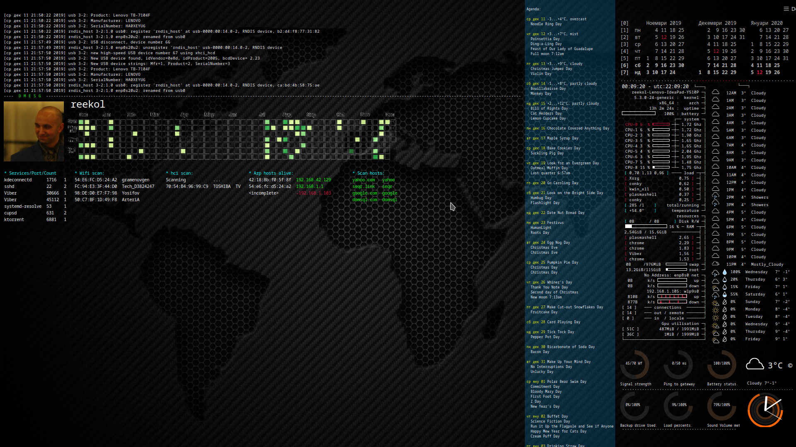

# conky


```bash
apt-get install -y jq lm-sensors conky-all curl gcalcli sox zenity imagemagick
sensors-detect
gcalcli agenda
cd ~
#Execute sudo in case you do not have permissions for port stats in ~/.conky/.conkyrc

git clone https://github.com/reekol/conky.git ./.conky

```


## Create ./.myconkyrc containing:

```
conky.config = {
    own_window_type='normal',
    alignment='top_left',
    gap_x=0,
    gap_y=0,
    maximum_width=300,
    background=true,
    use_xft=true,
    font='Monospace:size=7',
    xftalpha=1,
    update_interval=1.0,
    total_run_times=0,
    own_window=true,
    own_window_transparent=true,
    own_window_hints='undecorated,below,sticky,skip_taskbar,skip_pager',
    double_buffer=true,
    draw_shades=false,
    draw_outline=false,
    draw_borders=false,
    draw_graph_borders=true,
    stippled_borders=0,
    border_width=0,
    default_shade_color='black',
    default_outline_color='white',
    no_buffers=true,
    cpu_avg_samples=2,
    net_avg_samples=2,
    override_utf8_locale=true,
    use_spacer='right',
    own_window_argb_visual=true,
    default_color='white',
    color0='green',
    color1='cyan',
    color2='DC143C',
    pad_percents=3
}

conky.text = [[
 ${exec cd ~/.conky/ && zenity --password | sudo -S  bash ./planb.sh  }
 ${exec cd ~/.conky/ && sudo conky -c ./.conky-services }
 ${exec cd ~/.conky/ && sudo conky -c ./.conky-arp      }
 ${exec cd ~/.conky/ && sudo conky -c ./.conky-wifi     }
 ${exec cd ~/.conky/ && sudo conky -c ./.conky-hci      }
 ${exec cd ~/.conky/ && sudo conky -c ./.conky-hosts    }
 ${exec cd ~/.conky/ &&      conky -c ./.conky-dmesg    }
 ${exec cd ~/.conky/ &&      conky -c ./.conkyrc        }
 ${exec cd ~/.conky/ &&      conky -c ./.conky-rings    }
 ${exec cd ~/.conky/ &&      conky -c ./.conky-cal      }
 ${exec cd ~/.conky/ &&      conky -c ./.conky-clock    }
 ${exec cd ~/.conky/ &&      conky -c ./.conky-weather  }
 ${exec cd ~/.conky/ &&      conky -c ./.conky-gcal     }
 ${exec cd ~/.conky/ &&      conky -c ./.conky-git      }
]]

 
```

## Configation is stored in *./.config* file
## To start use:

```bash
conky ./.myconkyrc
```
